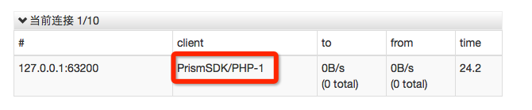
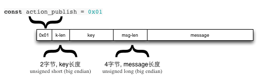

# 协议细节

本文说明使用websocket在本平台发布与订阅消息的数据协议细节, 由两部分组成. 

1. websocket协议本身, 如果你有合适的类库, 可以直接跳过.
1. 本平台利用websocket之上进行消息的发布与订阅的协议细节.

## websocket协议

### 建立连接

**1. 客户端: **发起请求.
```
GET /api/notify?client_id=xkg3ydnm&sign_time=1400567172&sign_method=md5&sign=D6174649DEDDF15FBE2D614FFDDF77A8 HTTP/1.1
Host: 127.0.0.1:8080
Pragma: no-cache
Cache-Control: no-cache
User-Agent: PrismSDK/PHP-1
Upgrade: websocket
Sec-Websocket-Key: MTQwMDU2NzE3Mg==
Sec-WebSocket-Version: 13
Sec-WebSocket-Protocol: chat
Origin: http://127.0.0.1:8080/api
Connection: Upgrade
```

- 使用调用其他api相同的签名方式
- 注意``Connection: Upgrade``以及``Upgrade: websocket``.
- 以后你可能会有许许多多应用, 传递``User-Agent``方便在应用的管理页面查看连接.



**2. 服务器: **返回``101 Switching Protocols``头表示已经切换为websocket协议
```
HTTP/1.1 101 Switching Protocols
```

此时数据流已经切换到websocket的双向通道.

### 消息的封包

websocket的数据以frame为单位进行传输. [RFC6455][1]

frame有以下几种类型:
```
const TextFrame   = 0x01;
const BinaryFrame = 0x02;
const CloseFrame  = 0x08;
const PingFrame   = 0x09;
const PongFrame   = 0x09;
```

每个frame包含header + body两部分.

当设置为masking时, header需要包含一个随机产生的masking-key.
masking-key为4字节. 正文的body需以4字节为循环与masking-key相对的位进行**异或**运算.

[查看php版本的实现][2], 详细的结构如下:
```
0 1 2 3 4 5 6 7 8 9 0 1 2 3 4 5 6 7 8 9 0 1 2 3 4 5 6 7 8 9 0 1
+-+-+-+-+-------+-+-------------+-------------------------------+
|F|R|R|R| opcode|M| Payload len |    Extended payload length    |
|I|S|S|S|  (4)  |A|     (7)     |             (16/64)           |
|N|V|V|V|       |S|             |   (if payload len==126/127)   |
| |1|2|3|       |K|             |                               |
+-+-+-+-+-------+-+-------------+ - - - - - - - - - - - - - - - +
|     Extended payload length continued, if payload len == 127  |
+ - - - - - - - - - - - - - - - +-------------------------------+
|                               |Masking-key, if MASK set to 1  |
+-------------------------------+-------------------------------+
| Masking-key (continued)       |          Payload Data         |
+-------------------------------- - - - - - - - - - - - - - - - +
:                     Payload Data continued ...                :
+ - - - - - - - - - - - - - - - - - - - - - - - - - - - - - - - +
|                     Payload Data continued ...                |
+---------------------------------------------------------------+
```

## 消息的处理

客户端的指令目前有3种:

```
const action_publish = 0x01;
const action_consume = 0x02;
const action_ack     = 0x03;
```

### 接收消息

接手消息时, 使用BinaryFrame格式发送一个action_consume指令``0x02``.

随后, 读取连接中的数据即可, 每个frame会传输一个json格式的消息.
```
{"time":1400568648,"tag":"1","key":"order.new","body":"message hello world: 0"}
```

#### 应答消息
消息需要进行应答(Ack) 之后, 服务器端才会真正删除, 应答的方法是发送应答包.

- 应答包 = ``action_ack + message-tag``
    - ``action_ack`` = ``0x03``
    - ``message-tag`` = ``"1"`` = ``0x49``(Ascii)
- 应答包 = ```0x03 0x49```

同样, 使用BinaryFrame进行发送.

**注意: 确认在业务系统处理完消息之后再进行应答, 保证数据不丢失.**

### 发布消息

消息有两个部分. 1. 正文message,  2. RoutingKey

详细格式如下:



因此routing-key最长不能超过256, 消息体不能超过65536.

[1]: http://tools.ietf.org/html/rfc6455#page-27       "rfc6455"
[2]: https://github.com/ShopEx/prism-php/blob/master/lib/notify.php#L123     "php版本实现"