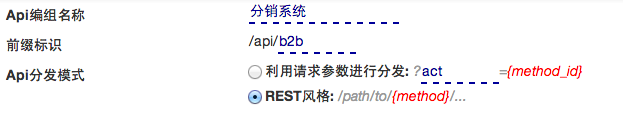
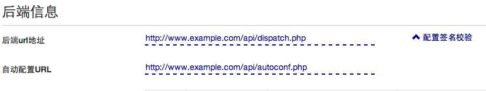

# api-json文件

放到一个可供http访问的位置即可.
比如: http://www.example.com/apidb/orders.json


# 基本信息


```json
   {
        "summary": "分销系统",
        "prefix": "b2b",
        "mode": "path", //path: rest风格, param: 根据某个参数进行调度
        "param_name": "method", //mode=param时,  调度的参数名
        ...
   }
```

# 后端信息


```json
   {
        ...
        "url": "http://www.example.com/api/dispatch.php",
        "auto_config_url": "http://www.example.com/api/autoconf.php",
        ...
   }
```

## 后端配置


```json
   {
        ...
        "config_values": [
            { "name": "token", "description": "token", "defaultvalue": "", "issecret": false },
            ...
        ],
        ...
   }
```

## 后端全局参数

```json
   {
        ...
        "global_params": [
            { "name": "api_version", "param_type": "request", "value_type": "expr", "format": "3.2" },
            { "name": "return_data", "param_type": "request", "value_type": "expr", "format": "json" },
            { "name": "ac", "param_type": "request", "value_type": "sign", "format": "shopex" }
        ]
        ...
   }
```

# api定义

## api基本信息


```json
    {
        ...
        "apis": {
            "search_order_lists": {
                "path": "",
                "method": [ "post" ],
                "summary": "获取订单列表",
                "notes": "",
                "limit_seconds": 0,
                "limtt_count": 0,
                ...
                }
           }
        ...
    }
```

## api参数


```json
    {
        ...
        "apis": {
            "search_order_lists": {
                ...
                "params": [
                    { "name": "start_time", "desc": "2013-06-01", 
                        "required": true, "type": "date", "param_type": "param" },
                    { "name": "end_time", "desc": "2013-06-30", 
                        "required": false, "type": "date", "param_type": "param" },
                    { "name": "status", "desc": "订单状态", 
                        "required": false, "type": "date", "param_type": "param" }
                ],
                ...
                }
           }
        ...
    }
```

## api返回结果

```json
    {
        ...
        "apis": {
            "response": "response data format"
        ...
    }
```


一个完整的例子如下:

```json
{
    "url": "http://www.example.com/api/dispatch.php",
    "prefix": "b2b",
    "summary": "分销系统",
    "apis": {
        "search_order_lists": {
            "path": "",
            "method": [ "POST" ],
            "summary": "获取订单列表",
            "notes": "",
            "limit_seconds": 0,
            "limtt_count": 0,
            "params": [
                { "name": "start_time", "desc": "2013-06-01", 
                    "required": true, "type": "date", "param_type": "param" },
                { "name": "end_time", "desc": "2013-06-30", 
                    "required": false, "type": "date", "param_type": "param" },
                { "name": "status", "desc": "订单状态", 
                    "required": false, "type": "date", "param_type": "param" }
            ],
            "response": "",
            "exception": [
                {
                    "httpcode": 200,
                    "code": 0,
                    "message": ""
                }
            ]
        }
    },
    "mode": "path",
    "param_name": "act",
    "models": {},
    "auto_config_url": "http://www.example.com/api/autoconf.php",
    "config_values": [
        { "Name": "token", "Description": "token", "DefaultValue": "", "IsSecret": false }
    ],
    "global_params": [
        { "name": "api_version", "paramtype": "REQUEST", "valuetype": "expr", "format": "3.2" },
        { "name": "return_data", "paramtype": "REQUEST", "valuetype": "expr", "format": "json" },
        { "name": "ac", "paramtype": "REQUEST", "valuetype": "sign", "format": "shopex" }
    ]
}
```