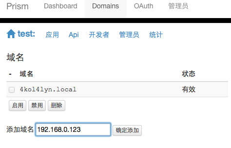

# 安装和初始化

## 安装
编辑conf/app.conf

```
[default]
appname = prism
runmode = dev
debug = true
mongodb = 127.0.0.1
webapp_listen = :8080
super_listen = :8081
masterdomain = .local:8080

[notify]
notify_support = true
rabbitmq_server = amqp://127.0.0.1:5672
rabbitmq_user = guest
rabbitmq_password = guest
rabbitmq_vhost = prism
rabbitmq_web = http://127.0.0.1:15672/%
```

最主要是mongodb的服务器. 没有mongo,  prism是没办法启动的.

webapp_listen  prism的主服务web端口
super_listen  prism的超级管理界面端口.  只针对SAAS模式,  如果是单用户模式,  则该选项无效.

如果设置  notify_support = false,  则禁用了websocket的notify,  prism可以不需要rabbitmq支持.


## 系统初始化

### 初始化: 单站点模式

mongo启动后.  启动Prism.  
prism会判断mongo中是否已经有实例信息, 如果没有, 会自动完成初始化. 并创建管理员用户.

用户名admin, 初始密码admin

查看日志, 可见:

```
2014/07/04 17:08:17 [info] shopex open platform <Prism>single server started.
2014/07/04 17:08:17 [info] current cmd: ./prism.single
2014/07/04 17:08:17 [info] config: /Users/wanglei/.gvm/pkgsets/go1.2/global/src/git.ishopex.cn/matrix/prism/conf/app.conf
2014/07/04 17:08:17 [info] help: https://github.com/ShopEx/prism-doc/tree/master/4.technical/2.cli.md
2014/07/04 17:08:17 [info] creating domain
2014/07/04 17:08:17 [info] created user=admin, password="admin"
2014/07/04 17:08:17 [count] Api: 0
2014/07/04 17:08:17 [count] Developer: 0
2014/07/04 17:08:17 [AMQP] Connecting amqp://127.0.0.1:5672/prism...
2014/07/04 17:08:17 [AMQP] success
```

直接访问后台, 使用admin:admin登录.
http://127.0.0.1:8080/admin/

### 初始化: SAAS模式

通过以下步骤来完成初始化, 并创建一个可用的prism站点.

1. 启动mongo和prism.  日志会显示没有站点: Domain: 0

    ```
    2014/07/04 17:16:55 [info] shopex open platform <Prism> server started.
    2014/07/04 17:16:55 [info] current cmd: ./prism
    2014/07/04 17:16:55 [info] config: /Users/wanglei/.gvm/pkgsets/go1.2/global/src/git.ishopex.cn/matrix/prism/conf/app.conf
    2014/07/04 17:16:55 [info] help: https://github.com/ShopEx/prism-doc/tree/master/4.technical/2.cli.md
    2014/07/04 17:16:55 [count] Domain: 0
    2014/07/04 17:16:55 [count] Staff: 0
    2014/07/04 17:16:55 [count] Api: 0
    2014/07/04 17:16:55 [count] Developer: 0
    2014/07/04 17:16:55 [AMQP] Connecting amqp://127.0.0.1:5672/prism...
    2014/07/04 17:16:55 [AMQP] success
    ```

1. 创建超级管理员帐号.
    
    使用命令行``./prism useradd root`` 创建用户root

    ```
    2014/07/04 17:18:20 MongoDB: 127.0.0.1, connecting...
    2014/07/04 17:18:20 success.
    User created, password=lbv2qfit
    ```

1. 用超级管理员帐号登录超级后台.  使用上一个命令所产生的随机密码登录.
    
    http://127.0.0.1:8081/   root:lbv2qfit

1. 用超级后台创建站点,  并绑定域名.
    
    1. Domains > 创建新域 ..

        

        填写信息并保存, 注意填写并记录新站点的admin密码.

        

    1. 系统会自动为新站点分配一个二级域名, 例如: ``4kol4lyn.local:8080``
        
        现在可以给这个站点设置一个基于IP的名称, 这样更便于内网小伙伴们玩耍.
        例如: ``添加域名`` : ``192.168.0.123:8080`` 保存.

        

    至此大功告成, 很简单是不是.
