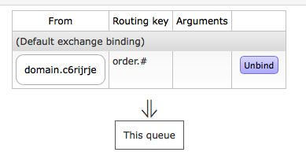

# 资源定位

## 每个Domain对应一个Exchange

该Exchange名称为 ``domain.{DomainId}``,  会在第一条绑定关系建立是自动创建.

其中DomainId即该站点的子域名.

## 每个Key对应一个Queue.

Queue的名字是 ``key.{DomainId}-{Key}``

设置绑定规则是会自动映射到该域对应Exchange上.

会产生下述绑定:

## 命令行工具

如果更换了RabbitMQ, 可以直接运行``prism rebindmq``将绑定关系重建在MQ中. 并且建立所有依赖的Exchange与Queue.